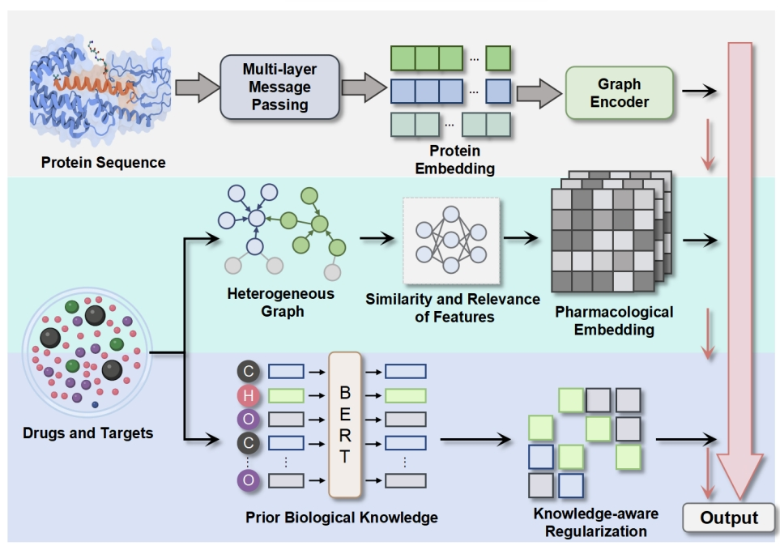

# Hetero-KGraphDTI

<div align="center">
  
  <h3>Graph-Based Drug-Target Interaction Prediction Framework</h3>
</div>

## Overview

Hetero-KGraphDTI is a novel framework that combines graph representation learning with knowledge integration for enhanced drug-target interaction (DTI) prediction. This repository contains the implementation of our approach that leverages graph neural networks to learn informative representations of drugs and targets from their molecular structures and protein sequences, while integrating biological knowledge from biomedical ontologies.

Our framework significantly outperforms state-of-the-art methods across multiple benchmark datasets, achieving an average AUC of 0.98 and an average AUPR of 0.89.

## Key Features

- **Heterogeneous Graph Construction**: Integration of multiple types of data, including chemical structures, protein sequences, and interaction networks
- **Knowledge-Aware Learning**: Incorporates biological knowledge from knowledge graphs (Gene Ontology, DrugBank, KEGG)
- **Attention Mechanism**: Graph attention network that focuses on the most informative parts of the graph
- **Interpretable Results**: Identifies key molecular substructures and protein motifs driving interactions
- **Validated Performance**: Experimental confirmation of predicted novel DTIs for applications in drug discovery and repurposing

## Directory Structure

```
├── Scripts/           # Helper scripts for data processing and analysis
├── network/           # Implementation of the graph neural networks
├── Molecular_01.png   # Logo image
├── create_data.py     # Script for creating training/validation data
├── training.py        # Main training script
├── training_validation.py # Training with validation implementation
└── utils.py           # Utility functions
```

## Installation

```bash
# Clone the repository
git clone https://github.com/Laboratory-EverythingAI/Hetero-KGraphDTI.git
cd Hetero-KGraphDTI

# Create and activate a new conda environment
conda create -n hetero-kgraph python=3.8
conda activate hetero-kgraph

# Install dependencies
pip install -r requirements.txt
```

## Usage

### Data Preparation

```bash
python create_data.py --dataset drugbank --split 0.8 0.1 0.1
```

### Model Training

```bash
python training.py --config configs/default.yaml
```

### Model Evaluation

```bash
python training_validation.py --model_path models/best_model.pt --test_data data/test_set.pkl
```

## Datasets

Our model has been evaluated on multiple benchmark datasets:
- DrugBank
- KEGG
- IUPHAR
- ChEMBL

## Performance

| Method              | DrugBank AUC | KEGG AUC | IUPHAR AUC | ChEMBL AUC |
|---------------------|--------------|----------|------------|------------|
| DeepDTI             | 0.956        | 0.958    | 0.956      | 0.975      |
| NeoDTI              | 0.948        | 0.951    | 0.947      | 0.969      |
| DTIP                | 0.940        | 0.943    | 0.938      | 0.963      |
| NRLMF               | 0.933        | 0.936    | 0.931      | 0.957      |
| **Hetero-KGraphDTI**| **0.987**    | **0.981**| **0.985**  | **0.991**  |

## Applications

Hetero-KGraphDTI has been successfully applied to:
1. Identifying novel therapeutic targets for Alzheimer's disease
2. Repurposing existing drugs for COVID-19

## Citation

If you use Hetero-KGraphDTI in your research, please cite our paper:

```bibtex
@article{sun2025uncovering,
  title={Uncovering Novel Therapeutic Targets through Graph-Based Drug-Target Interaction Prediction},
  author={Sun, Jianhua and Cao, Ye and Zhou, Ying and Qi, Baoqiao},
  journal={},
  year={2025},
  publisher={}
}
```

## License

This project is licensed under the MIT License - see the LICENSE file for details.

## Acknowledgements

We thank the contributors of DrugBank, KEGG, IUPHAR, and ChEMBL for providing the datasets used in this research.
